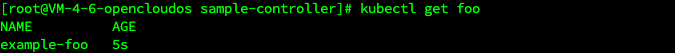
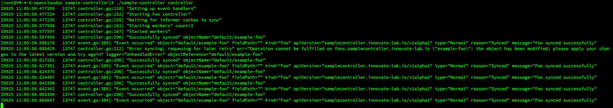

# sample-controller

This repository wrapped by cobra and implements a simple controller for watching Foo resources as defined with a
CustomResourceDefinition (CRD).

Note: go-get or vendor this package as k8s.io/sample-controller.

This particular example demonstrates how to perform basic operations such as:

- How step by step to write a controller with the controller-runtime as well as code-generator
- How to register a new custom resource (custom resource type) of type Foo using a CustomResourceDefinition.
- How to create/get/list instances of your new resource type Foo.
- How to setup a controller on resource handling create/update/delete events.

## Prerequisites

- golang 1.23.0
- code-client v0.31.1

## Steps

clone repo, you can test this repo in you own k8s cluster, like minikube, kind, etc.

## Create a kind cluster

Here using kind 0.19.0, create a kubernetes cluster with v1.26.0 version.

```shell
kind create cluster --name sample-controller --config kind-config.yaml --image=kindest/node:v1.26.0
```

## Running

### Prerequisite: Since the sample-controller uses apps/v1 deployments, the Kubernetes cluster version should be greater than 1.9.

```shell
# create a CustomResourceDefinition
kubectl create -f examples/crd-status-subresource.yaml

# create a custom resource of type Foo
kubectl create -f examples/example-foo.yaml

# check deployments created through the custom resource
kubectl get deployments

```

now you can see the deployment created by the custom resource. and you can see the log of the sample-controller as
follows:

sample-controller log


## Use Cases

CustomResourceDefinitions can be used to implement custom resource types for your Kubernetes cluster. These act like
most other Resources in Kubernetes, and may be kubectl apply'd, etc.

Some example use cases:

- Provisioning/Management of external datastores/databases (eg. CloudSQL/RDS instances)
- Higher level abstractions around Kubernetes primitives (eg. a single Resource to define an etcd cluster, backed by a
  Service and a ReplicationController)

## Cleanup

You can clean up the created CustomResourceDefinition with:

```shell
kubectl delete crd foos.samplecontroller.k8s.io
```

